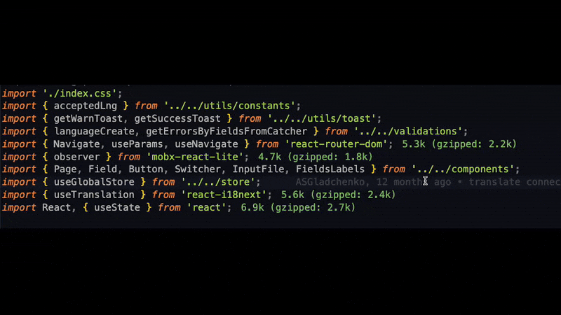

# Sort Imports

<p align="center">
  
</p>

Automatically sorts and organizes imports in JavaScript and TypeScript files by line length.

## Features

- 🚀 **Smart Sorting:** Imports are grouped by type and sorted by length
- ⚙️ **Configurable:** Ability to change maximum line length and path aliases
- ⌨️ **Keyboard Shortcuts:** Ctrl+Alt+O (Windows/Linux) or Cmd+Alt+O (macOS)
- 📝 **Context Menu:** Command available in editor context menu
- 🎯 **Format Provider:** Works as a formatting provider

## Import Grouping

Imports are grouped in the following order:

1. **Directives** — 'use client', 'use server'
2. **React** — react and react/*
3. **External Libraries** — npm packages
4. **Absolute Imports** — paths with aliases (@/, ~)
5. **Relative Imports** — local files (., ..)
6. **Side Effect Imports** — imports without from
7. **Styles** — CSS, SCSS, SASS, LESS files

## Settings

You can configure the extension through VS Code settings:

```json
{
  "sortImports.maxLineLength": 100, // Maximum import line length
  "sortImports.aliasPrefixes": ["@/", "~"] // Prefixes for absolute paths
}
```

## Demo



## Example

**Before:**

```ts
import './styles.css';
import { Component } from 'react';
import { someUtilFunction, anotherFunction } from '../utils/helpers';
import axios from 'axios';
import { apiCall } from '@/services/api';
import lodash from 'lodash';
```

**After:**

```ts
import { Component } from 'react';

import axios from 'axios';
import lodash from 'lodash';

import { apiCall } from '@/services/api';

import { someUtilFunction, anotherFunction } from '../utils/helpers';

import './styles.css';
```

## Usage

- Open a .js, .ts, .jsx or .tsx file
- Run **Sort Imports** command via command palette (Cmd+Shift+P / Ctrl+Shift+P)
- Or use keyboard shortcuts: `Cmd+Alt+O` (Mac) / `Ctrl+Alt+O` (Windows/Linux)
- Also available in editor context menu

## Supported Files

- JavaScript (.js)
- TypeScript (.ts)
- JSX (.jsx)
- TSX (.tsx)

## Requirements

- VS Code version 1.74.0 or higher
- JavaScript/TypeScript files

## License

MIT
