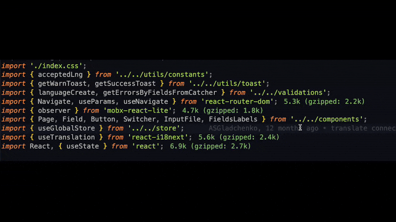

# Sort Imports

<p align="center">
  
</p>

Automatically sorts and organizes imports in JavaScript and TypeScript files by line length.

## Features

- 🚀 **Smart Sorting:** Imports are grouped by type and sorted by length
- 💬 **Comment Preservation:** Comments within import blocks are preserved in their original order
- 🔧 **Interface Sorting:** Interface properties are sorted by length within the interface body
- ⚡ **Function Extraction:** Functions and constants are extracted from import blocks and placed after
- ⚙️ **Configurable:** Ability to change maximum line length and path aliases
- ⌨️ **Keyboard Shortcuts:** Ctrl+Alt+O (Windows/Linux) or Cmd+Alt+O (macOS)
- 📝 **Context Menu:** Command available in editor context menu
- 🎯 **Format Provider:** Works as a formatting provider

## Import Grouping

Imports are grouped in the following order:

1. **Directives** — 'use client', 'use server'
2. **React** — react and react/\*
3. **External Libraries** — npm packages
4. **Absolute Imports** — paths with aliases (@/, ~/, src/)
5. **Relative Imports** — local files (., ..)
6. **Side Effect Imports** — imports without from
7. **Styles** — CSS, SCSS, SASS, LESS files
8. **Interfaces and Types** — TypeScript `interface` and `type` declarations (including `export`) placed after imports; interface properties are sorted by length
9. **Comments** — preserved in their original order after imports
10. **Functions** — const, function, export const, export function declarations (at the very end)

## Settings

You can configure the extension through VS Code settings:

```json
{
  "sortImports.maxLineLength": 100, // Maximum import line length
  "sortImports.indentSize": "  ", // Indentation for wrapped imports
  "sortImports.aliasPrefixes": ["@/", "~/", "src/"] // Extendable alias list
}
```

## Demo



## Example

**Before:**

```ts
import './styles.css';
import { Component } from 'react';
// Comment about utils
import { someUtilFunction, anotherFunction } from '../utils/helpers';
import axios from 'axios';
/* Comment about API service */
import { apiCall } from '@/services/api';
import lodash from 'lodash';

interface User {
  verylongpropertynamefortest: string;
  id: number;
  name: string;
  email: string;
  age: number;
}
```

**After:**

```ts
import { Component } from 'react';

import axios from 'axios';
import lodash from 'lodash';

import { apiCall } from '@/services/api';

import { someUtilFunction, anotherFunction } from '../utils/helpers';

import './styles.css';

interface User {
  id: number;
  age: number;
  name: string;
  email: string;
  verylongpropertynamefortest: string;
}

// Comment about utils
/* Comment about API service */
```

## Usage

- Open a .js, .ts, .jsx or .tsx file
- Run **Sort Imports** command via command palette (Cmd+Shift+P / Ctrl+Shift+P)
- Or use keyboard shortcuts: `Cmd+Alt+O` (Mac) / `Ctrl+Alt+O` (Windows/Linux)
- Also available in editor context menu

## Supported Files

- JavaScript (.js)
- TypeScript (.ts)
- JSX (.jsx)
- TSX (.tsx)

## Requirements

- VS Code version 1.74.0 or higher
- JavaScript/TypeScript files

## License

MIT
